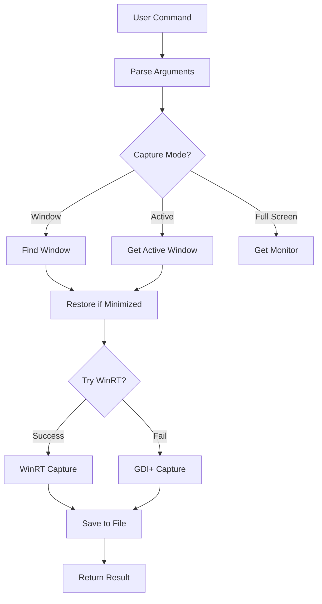

# Screen Capture Agent

Enterprise-grade screenshot automation tool for Windows with support for WinRT GraphicsCapture API and advanced window management.

## 🎯 Overview

Screen Capture Agent is a powerful command-line tool designed for enterprise ticketing systems, automated testing, and documentation workflows. It captures screenshots of windows, monitors, regions, and browser applications with support for both modern WinRT and legacy GDI+ capture methods.

### Key Features

- ✅ **Multiple Capture Modes**: Full screen, active window, specific window by title, region, multi-monitor
- ✅ **Browser Support**: Batch capture all Chrome/Edge windows without black screens
- ✅ **WinRT Graphics Capture**: Modern API for capturing Chrome/Edge browsers correctly
- ✅ **GDI+ Fallback**: Automatic fallback for compatibility
- ✅ **Minimized Window Handling**: Automatically restores and captures minimized windows
- ✅ **Self-Contained**: No .NET runtime installation required
- ✅ **Enterprise Ready**: Designed for ticketing systems (JIRA, ServiceNow, Zendesk)
- ✅ **Flexible Output**: PNG, JPEG, BMP with quality control
- ✅ **Batch Operations**: Capture multiple browser windows in one command
- ✅ **Silent Operation**: Run from scripts, scheduled tasks, or automation tools

## 🖼️ Screenshots
```cmd
# Capture active window
ScreenCapture.exe -m active

# Capture all Chrome windows
ScreenCapture.exe -m chrome -d C:\Screenshots

# Capture specific application
ScreenCapture.exe -m window -w "Excel" -d C:\Reports
```

## 📋 System Requirements

### Operating System
- Windows 10 (Version 1903 or later)
- Windows 11
- 64-bit (x64) architecture

### Runtime
- **Self-contained deployment** - No .NET installation required
- All dependencies embedded in executable

### Permissions
- Standard user permissions (for most captures)
- Administrator rights (only for capturing elevated windows)

## 🚀 Quick Start

### Basic Usage
```cmd
# Capture full screen
ScreenCapture.exe

# Capture active window
ScreenCapture.exe -m active -d C:\Screenshots

# Capture specific window
ScreenCapture.exe -m window -w "Word" -d C:\Screenshots

# Capture all browser windows
ScreenCapture.exe -m chrome -d C:\BrowserCaptures

# Capture with custom delay
ScreenCapture.exe -m active --delay 3000 -d C:\Screenshots
```

## 📖 Usage

### Command-Line Syntax
```
ScreenCapture.exe [OPTIONS]
```

### Capture Modes

| Mode | Description | Example |
|------|-------------|---------|
| `full` | Capture entire screen | `-m full` |
| `active` | Capture active window | `-m active` |
| `window` | Capture by window title | `-m window -w "Chrome"` |
| `region` | Capture specific region | `-m region -r 100 100 800 600` |
| `multi` | Capture all monitors | `-m multi` |
| `monitor` | Capture specific monitor | `-m monitor --monitor 1` |
| `chrome` | Capture all Chrome windows | `-m chrome` |
| `edge` | Capture all Edge windows | `-m edge` |
| `browsers` | Capture all browser windows | `-m browsers` |

### Output Options

| Option | Description | Example |
|--------|-------------|---------|
| `-o, --output <path>` | Specific output file | `-o C:\Screenshots\capture.png` |
| `-d, --directory <path>` | Output directory | `-d C:\Screenshots` |
| `-p, --prefix <name>` | Filename prefix | `-p "bug_report_"` |
| `--quality <0-100>` | JPEG quality | `--quality 95` |

### Window Capture Options

| Option | Description | Example |
|--------|-------------|---------|
| `-w, --window <title>` | Window title (partial match) | `-w "Excel"` |
| `--delay <ms>` | Delay before capture | `--delay 2000` |
| `--cursor` | Include mouse cursor | `--cursor` |

### Advanced Options

| Option | Description |
|--------|-------------|
| `-v, --verbose` | Enable detailed logging |
| `--no-winrt` | Disable WinRT (use GDI+ only) |
| `--list-windows` | List all available windows |
| `-h, --help` | Show help message |

## 🔧 Building from Source

### Prerequisites

- [.NET 8 SDK](https://dotnet.microsoft.com/download/dotnet/8.0)
- Windows 10 SDK (10.0.19041 or later)
- Visual Studio 2022 (optional)

### Clone Repository
```bash
git clone https://github.com/your-org/screen-capture-agent.git
cd screen-capture-agent
```

### Build
```cmd
# Restore NuGet packages
dotnet restore

# Build in Release mode
dotnet build --configuration Release

# Publish self-contained executable
dotnet publish ScreenCaptureAgent\ScreenCaptureAgent.csproj ^
    --configuration Release ^
    --output publish\Release ^
    --self-contained true ^
    --runtime win-x64
```

### Output

The self-contained executable will be created at:
```
publish\Release\ScreenCapture.exe (~70 MB)
```

## 🏗️ Architecture

### Project Structure
```
ScreenCaptureAgent/
├── ScreenCaptureAgent/              # Main console application
│   ├── Program.cs                   # Entry point
│   └── CLI/
│       └── CommandLineParser.cs     # Argument parsing
├── ScreenCaptureAgent.Core/         # Core capture logic
│   ├── Models/                      # Data models
│   │   ├── CaptureMode.cs
│   │   ├── CaptureOptions.cs
│   │   ├── CaptureResult.cs
│   │   └── WindowInfo.cs
│   ├── Services/                    # Capture services
│   │   ├── ScreenCaptureService.cs  # Main orchestrator
│   │   ├── WinRtCaptureService.cs   # WinRT capture
│   │   └── GdiCaptureService.cs     # GDI+ fallback
│   └── Native/
│       └── NativeMethods.cs         # Win32 API interop
└── docs/                            # Documentation
```

### Capture Flow


### Technology Stack

- **Framework**: .NET 8.0
- **Graphics API**: WinRT GraphicsCapture, GDI+
- **3D API**: SharpDX (Direct3D11)
- **Target**: Windows Desktop (net8.0-windows)
- **Deployment**: Self-contained, single-file executable

## 🐛 Troubleshooting

### Common Issues

#### 1. "Window not found" Error
```cmd
# List available windows first
ScreenCapture.exe --list-windows

# Use partial window title
ScreenCapture.exe -m window -w "Word" -v
```

#### 2. Blank/Black Screenshots
```cmd
# Ensure window is not minimized (tool auto-restores)
# Add delay for rendering
ScreenCapture.exe -m window -w "Chrome" --delay 1000 -v

# Try GDI+ fallback
ScreenCapture.exe -m window -w "Chrome" --no-winrt -v
```

#### 3. Package Source Mapping Issues

If building in corporate environment:
```cmd
# Update global NuGet.config
notepad %APPDATA%\NuGet\NuGet.Config

# Add to packageSourceMapping section:
<packageSource key="nuget.org">
  <package pattern="Microsoft.*" />
  <package pattern="System.*" />
  <package pattern="SharpDX*" />
</packageSource>
```

#### 4. Access Violation Exception
```cmd
# Run as Administrator
# Or capture non-elevated windows only
ScreenCapture.exe -m window -w "Notepad" -v
```

### Exit Codes

| Code | Description |
|------|-------------|
| 0 | Success |
| 1 | General error |
| 2 | Invalid arguments |
| 3 | Capture failed |

## 📊 Performance

- **Startup Time**: < 100ms
- **Capture Time**: 50-200ms (depending on mode and resolution)
- **Memory Usage**: ~50-150 MB (during capture)
- **File Size**: 100 KB - 5 MB (PNG, varies by content)

## 🔒 Security Considerations

- Self-contained executable (~70 MB) - May trigger antivirus false positives
- Consider code signing for enterprise deployment
- Uses Windows GraphicsCapture API - Requires Windows 10 1903+
- Captures visible screen content only - Cannot capture DRM-protected content
- No network communication - Fully offline operation
- No data collection or telemetry